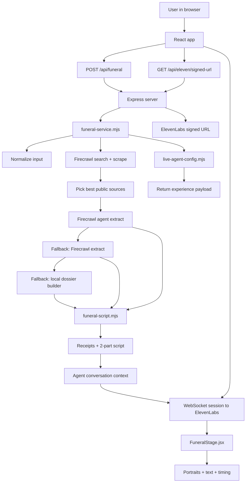

# ROAST

ROAST turns a public web profile into a short live AI funeral.

You paste a GitHub profile, personal site, or another public link. ROAST gathers public signal, builds a small dossier, writes a two-person eulogy, and performs it in the browser with ElevenLabs.

The current product is performance-first:

- one input
- one dossier
- two speakers: `Mom` and `Best Friend`
- one short live performance

It is not meant to be an open-ended voice assistant after the eulogy ends.

## What

ROAST does three things:

1. Finds public information about a person from the web.
2. Turns that into a short, evidence-backed funeral script.
3. Performs the script live with voice, portraits, and on-screen text.

What you get back from the API is an `experience` object with:

- the subject name
- a few receipts
- the two-part script
- a live agent configuration or an audio fallback

## Why

This project is built around a simple idea:

Public internet personas are weirdly theatrical. ROAST makes that visible by turning a profile into something that feels staged, personal, and a little uncomfortable.

The product is intentionally narrow because that keeps the experience strong:

- the input is simple
- the output is short
- the UI stays focused
- the performance feels like an event, not a chatbot demo

The current script style aims for plain English, dry humor, and recognizable receipts instead of vague AI poetry.

## How

At a high level, the app works like this:

1. The browser sends one profile input to `POST /api/funeral`.
2. The server figures out what kind of input it is and searches for useful public sources.
3. Firecrawl scrapes and extracts those sources into a dossier.
4. The dossier is turned into a two-part script.
5. The frontend starts a live ElevenLabs session.
6. The script and dossier are sent to the agent as runtime context.
7. The browser plays the performance while switching portraits and text for the active speaker.

## Architecture



## Main Flow

### 1. Input

The user types one public profile link into the form.

The current frontend entry points are:

- `src/App.jsx`
- `src/components/FuneralForm.jsx`

`App.jsx` controls the three screens:

- `summon`
- `conjuring`
- `funeral`

### 2. Source Collection

The server takes that input and tries to find real public text.

This happens in [`server/lib/funeral-service.mjs`](server/lib/funeral-service.mjs).

The pipeline does this:

1. Infer the likely platform from the input.
2. Build a few search plans.
3. Run Firecrawl search and scrape.
4. Keep the strongest sources.
5. Remove duplicates and weak results.

The goal is simple: do not write from thin air if real text exists.

### 3. Dossier Extraction

Once sources are selected, the server tries to build a dossier.

It uses a fallback chain:

1. Firecrawl Agent extraction
2. Firecrawl Extract
3. Local fallback dossier builder

This is important because the app should still return something useful even if one extraction path times out.

### 4. Script Writing

The dossier is turned into:

- a small list of receipts
- a two-part script
- a runtime prompt for the live agent

This logic lives in [`server/lib/funeral-script.mjs`](server/lib/funeral-script.mjs).

Current writing rules:

- only `Mom` and `Best Friend`
- plain colloquial English
- grounded tone
- dry humor
- no extra speakers
- no follow-up conversation after the eulogy

### 5. Live Performance

If ElevenLabs is configured, the app prefers live agent mode.

The server returns:

- `agentConversation`
- `liveAgent`
- the script
- the receipts

The frontend then:

1. asks the server for a signed URL
2. opens an authenticated WebSocket session with ElevenLabs
3. sends the runtime context and kickoff message
4. runs the stage UI while the agent speaks

This stage lives in [`src/components/FuneralStage.jsx`](src/components/FuneralStage.jsx).

Important behavior in the stage:

- microphone is muted during the scripted performance
- portraits and text switch on a client-side timing schedule
- the session is closed when the performance ends
- the UI is designed for a fixed show, not for open chat

## Why The System Is Split This Way

The architecture is intentionally split into small layers:

- `funeral-service.mjs` handles orchestration
- `funeral-script.mjs` handles writing
- `live-agent-config.mjs` handles agent setup
- `FuneralStage.jsx` handles the performance UI

This separation matters because each piece changes for a different reason:

- scraping changes when source quality changes
- writing changes when tone or speaker format changes
- agent config changes when ElevenLabs auth or session behavior changes
- UI timing changes when the stage feels off

## Runtime Modes

ROAST can run in three practical modes.

### 1. Live Agent Mode

This is the main mode.

Use it when:

- `ELEVENLABS_AGENT_ID` is set
- `ELEVENLABS_API_KEY` is set
- live agent mode is not skipped

Result:

- the browser plays a live ElevenLabs performance

### 2. Static Audio Mode

If a live agent is not used but ElevenLabs TTS is available, the server can generate audio for the script instead.

Result:

- the app still has spoken output
- but it is not a live agent session

### 3. Script-Only / Mock Mode

If Firecrawl or ElevenLabs is missing, the app can still fall back to mock data or a written-only flow.

Result:

- the product still works for local development
- but the output is less real

## Project Structure

The most important files are:

- [`src/App.jsx`](src/App.jsx)
- [`src/components/FuneralForm.jsx`](src/components/FuneralForm.jsx)
- [`src/components/FuneralStage.jsx`](src/components/FuneralStage.jsx)
- [`src/styles.css`](src/styles.css)
- [`server/app.mjs`](server/app.mjs)
- [`server/index.mjs`](server/index.mjs)
- [`server/lib/funeral-service.mjs`](server/lib/funeral-service.mjs)
- [`server/lib/funeral-script.mjs`](server/lib/funeral-script.mjs)
- [`server/lib/live-agent-config.mjs`](server/lib/live-agent-config.mjs)
- [`server/lib/mock-data.mjs`](server/lib/mock-data.mjs)

## API Endpoints

### `GET /api/health`

Returns a quick health check:

- whether Firecrawl is configured
- whether ElevenLabs is configured
- whether live agent mode is configured

### `POST /api/funeral`

Builds the full funeral experience.

Input:

```json
{
  "profileInput": "https://github.com/example"
}
```

Output includes:

- `subjectName`
- `receipts`
- `script`
- `dossier`
- `liveAgent`
- `agentConversation`

### `GET /api/eleven/signed-url`

Returns a signed URL for an authenticated ElevenLabs WebSocket session.

### `GET /api/eleven/conversation-token`

Returns an ElevenLabs conversation token.

The current frontend uses signed URL WebSocket mode.

## Local Development

Install dependencies:

```bash
bun install
```

Create your local env file:

```bash
cp .env.example .env
```

Start the app:

```bash
bun run dev
```

Open:

- `http://localhost:3001`

Useful commands:

```bash
bun run build
bun run start
```

## Environment Variables

The app expects a local `.env` file.

### Required for the full experience

- `FIRECRAWL_API_KEY`
- `ELEVENLABS_API_KEY`

### Required for live agent mode

- `ELEVENLABS_AGENT_ID`
- `ELEVENLABS_AGENT_REQUIRES_AUTH=true`

### Optional voice overrides

- `ELEVEN_VOICE_MOM_ID`
- `ELEVEN_VOICE_BEST_FRIEND_ID`

### Other optional values

- `ELEVENLABS_TTS_MODEL_ID`
- `PORT`

What these do:

- if Firecrawl is missing, the app falls back to mock data
- if ElevenLabs is missing, the app can still return a written experience
- if the live agent is missing, the app falls back to non-agent behavior

## ElevenLabs Setup For This Repo

This project works best with a dedicated ElevenLabs agent.

Recommended setup:

1. Create one agent just for ROAST.
2. Keep the dashboard prompt generic.
3. Let the app send the real dossier and script at runtime.
4. Turn authentication on.
5. Use a signed URL from the server.
6. Keep the agent performance-first, not chat-first.
7. Set the voices to match the labels used by the runtime tags:
   `Mom` and `BestFriend`

Important detail:

The live runtime prompt tells the agent to:

- perform the two speakers in order
- avoid open-ended follow-up
- stay silent after the performance

That is deliberate. The current app is built as a staged performance, not as a post-funeral voice assistant.

## Deploying On Vercel

This repo is ready for Vercel with Bun.

The Vercel build writes the frontend to `public/` and exposes the Express app through `api/[...path].mjs`.

Basic deploy flow:

1. Push the repo to GitHub.
2. Import it into Vercel.
3. Add the same environment variables you use locally.
4. Deploy.

Use:

- `bun install`
- `bun run build:vercel`

## Notes

- Use this on your own profile, or with permission.
- Public personal sites and GitHub profiles usually give the best results.
- The UI intentionally stays minimal so the performance stays front and center.
- There is currently no dedicated `portrait_mom.png`, so the app reuses the solemn portrait image for Mom.

## References

- [Firecrawl Search docs](https://docs.firecrawl.dev/features/search)
- [Firecrawl Extract docs](https://docs.firecrawl.dev/features/extract)
- [Firecrawl Agent docs](https://docs.firecrawl.dev/features/agent)
- [ElevenLabs docs](https://elevenlabs.io/docs)
- [ElevenAgents Overview](https://elevenlabs.io/docs/eleven-agents/overview)
- [ElevenAgents React SDK](https://elevenlabs.io/docs/eleven-agents/libraries/react)
