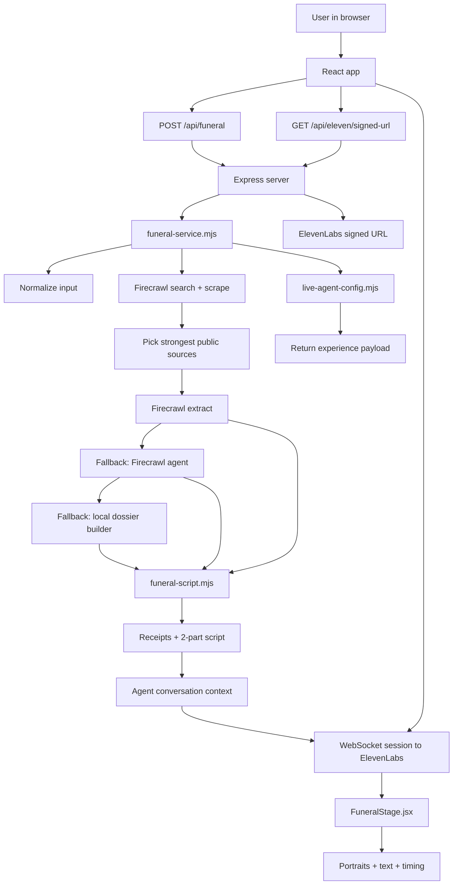

# ROAST

ROAST turns one public page into a short live AI funeral.

You paste a personal website or GitHub profile. ROAST gathers public signal, writes a two-person eulogy, and stages it in the browser with portraits, live voice, on-screen receipts, and a low ambient score.

The product is intentionally narrow:

- one input
- one dossier
- two speakers: `Mom` and `Best Friend`
- one short performance

It is not meant to become an open-ended assistant after the eulogy ends.

## Current Product Shape

The current UX asks for exactly one public page:

- personal website
- portfolio
- GitHub profile
- another scrapeable public page

Social links are intentionally not part of the main input anymore. In practice, Firecrawl can pull useful signal from websites and GitHub far more reliably than individual social posts, so ROAST now optimizes for a dependable demo rather than pretending it can always read blocked platforms.

## What ROAST Does

ROAST does four things:

1. Accepts one public page as input.
2. Searches and scrapes strong public sources around that page.
3. Builds a small dossier and writes a fixed two-part funeral.
4. Performs the funeral live in the browser with ElevenLabs.

The API returns an `experience` object with:

- subject name
- receipts / exhibits
- the two-part script
- a live agent configuration or static audio fallback

## Tone

The writing aims for:

- plain English
- dry observational humor
- short-story pacing
- self-owning details
- no purple prose

The current comedic lane is closer to sharp conversational stand-up than to poetic AI writing. It should feel like people who knew the subject, not like a generic narrator.

## High-Level Flow

1. The browser sends one profile input to `POST /api/funeral`.
2. The server infers the platform and collects public sources.
3. Firecrawl search and scrape provide source text.
4. The server tries to extract a dossier.
5. The dossier is converted into receipts plus a two-part script.
6. The frontend opens a live ElevenLabs session.
7. The stage performs the eulogy while the browser handles timing, portraits, text, and ambient score.

## Architecture



## Important Files

- [`src/App.jsx`](src/App.jsx)
- [`src/components/FuneralForm.jsx`](src/components/FuneralForm.jsx)
- [`src/components/FuneralStage.jsx`](src/components/FuneralStage.jsx)
- [`src/lib/ambient-score.js`](src/lib/ambient-score.js)
- [`src/styles.css`](src/styles.css)
- [`server/app.mjs`](server/app.mjs)
- [`server/index.mjs`](server/index.mjs)
- [`server/lib/funeral-service.mjs`](server/lib/funeral-service.mjs)
- [`server/lib/funeral-script.mjs`](server/lib/funeral-script.mjs)
- [`server/lib/live-agent-config.mjs`](server/lib/live-agent-config.mjs)
- [`server/lib/mock-data.mjs`](server/lib/mock-data.mjs)

## Frontend Behavior

`src/App.jsx` controls three screens:

- `summon`
- `conjuring`
- `funeral`

The ambient score is managed at the app level so it can carry across the entire experience instead of only starting once the performance begins.

Because browsers often block autoplay audio, the score is designed to begin as soon as the browser allows playback, usually on the first user interaction if autoplay is restricted.

`src/components/FuneralStage.jsx` handles:

- live session start
- portrait switching
- speaker timing
- receipt display
- return-home flow
- score ducking while voices are speaking

## Source Collection

Source collection lives in [`server/lib/funeral-service.mjs`](server/lib/funeral-service.mjs).

The pipeline is deliberately bounded:

1. infer the platform
2. build a small fixed set of search plans
3. run bounded Firecrawl search calls
4. score and dedupe candidates
5. keep only the top sources

This keeps the system predictable and avoids unbounded growth in work per request.

## Dossier Extraction

Once sources are selected, the server uses this fallback chain:

1. Firecrawl Extract
2. Firecrawl Agent
3. local fallback dossier builder

This gives ROAST a good chance of returning something useful even when one extraction method is slow or fails.

## Script Rules

Script generation lives in [`server/lib/funeral-script.mjs`](server/lib/funeral-script.mjs).

Current rules:

- only `Mom` and `Best Friend`
- plain colloquial English
- dry and observational humor
- no extra speakers
- no post-eulogy conversation
- no name repetition unless the script explicitly includes it

## Runtime Modes

### 1. Live Agent Mode

Main path when these are configured:

- `ELEVENLABS_AGENT_ID`
- `ELEVENLABS_API_KEY`

Result:

- the browser plays a live ElevenLabs performance

### 2. Static Audio Mode

If live agent mode is skipped but TTS is available:

- the server can generate dialogue audio for the script

### 3. Script / Mock Mode

If Firecrawl or ElevenLabs is missing:

- the app can still run with mock data or script-only behavior for development

## API

### `GET /api/health`

Returns whether:

- Firecrawl is configured
- ElevenLabs is configured
- live agent mode is configured

### `POST /api/funeral`

Accepts:

```json
{
  "profileInput": "https://github.com/you",
  "consentConfirmed": true
}
```

Returns a staged `experience` payload for the frontend.

## Running Locally

Install dependencies and run:

```bash
bun run dev
```

Helpful env vars:

- `FIRECRAWL_API_KEY`
- `ELEVENLABS_API_KEY`
- `ELEVENLABS_AGENT_ID`
- `ELEVEN_VOICE_MOM_ID`
- `ELEVEN_VOICE_BEST_FRIEND_ID`

## Design Intent

ROAST works best when it feels like a tiny event:

- one clean input
- one tense loading state
- one fixed performance
- one memorable exit card

The strongest version of the project is not “AI that says funny things.” It is a tightly staged ritual for the version of you the public web can actually prove exists.
